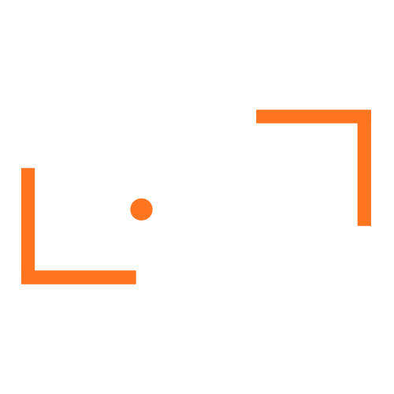

  

# Erdican Eroğlu

### Full Stack Developer • Cyber Security • Automation Systems  
### Yazılım • Siber Güvenlik • Otomasyon • AI Destekli Sistemler

 

<table align="center" width="100%">
<tr>
<td align="center" width="33%">

<a href="https://e-devtech.com/">
<strong>Website</strong> 
e-devtech.com
</a>

</td>
<td align="center" width="33%">

<a href="mailto:erdicaneroglu@e-devtech.com">
<strong>Corporate Mail</strong> 
erdicaneroglu@e-devtech.com
</a>

</td>
<td align="center" width="33%">

<a href="mailto:erdicanerogluinfo@gmail.com">
<strong>Personal Mail</strong> 
erdicanerogluinfo@gmail.com
</a>

</td>
</tr>
</table>

---

<h2>

About / Hakkımda
</h2>

<table align="center" width="100%">
<tr>
<td width="50%" valign="top" align="center">

<h3>TR</h3>

E-DevTech çatısı altında web yazılım, özel panel sistemleri, otomasyon çözümleri, API entegrasyonları ve siber güvenlik odaklı projeler geliştiriyorum.

Hedefim sade, hızlı, güvenli ve uzun vadede sorunsuz çalışan sistemler kurmak.

</td>
<td width="50%" valign="top" align="center">

<h3>EN</h3>

I build web applications, custom admin panels, automation systems, API integrations and cyber security focused software solutions under E-DevTech.

My goal is to develop clean, fast, secure and scalable systems.

</td>
</tr>
</table>

---

<h2>

Skills / Yetkinlikler
</h2>

<table align="center" width="100%">
<tr>
<td align="center" width="33%" valign="top">

<h3>Web Development</h3>

HTML 
CSS 
JavaScript 
PHP 
Laravel 
React 
Node.js 
Responsive UI

</td>
<td align="center" width="33%" valign="top">

<h3>Backend & API</h3>

REST API 
Admin Panels 
Database Systems 
Authentication Systems 
Server Side Logic 
Custom CRM Panels 
Payment Integrations

</td>
<td align="center" width="33%" valign="top">

<h3>Cyber Security</h3>

Web Security 
Linux Security 
Basic Pentest 
Server Hardening 
Secure System Setup 
Security Checks 
Access Control

</td>
</tr>

<tr>
<td align="center" width="33%" valign="top">

<h3>Automation</h3>

Python Bots 
VDS Automation 
Workflow Systems 
n8n Automations 
Macro Systems 
Webhook Systems 
Task Automation

</td>
<td align="center" width="33%" valign="top">

<h3>AI Tools</h3>

AI Assisted Coding 
Prompt Engineering 
AI Workflow Design 
Smart Automation 
AI Business Solutions 
AI Agents 
Process Optimization

</td>
<td align="center" width="33%" valign="top">

<h3>DevOps & Server</h3>

Linux Server 
Hosting Setup 
Git / GitHub 
Deployment 
Maintenance 
Backup Systems 
Domain / SSL Setup

</td>
</tr>
</table>

---

<h2>

Technologies / Teknolojiler
</h2>

<table align="center" width="100%">
<tr>
<td align="center" width="25%">HTML</td>
<td align="center" width="25%">CSS</td>
<td align="center" width="25%">JavaScript</td>
<td align="center" width="25%">PHP</td>
</tr>
<tr>
<td align="center">Laravel</td>
<td align="center">Node.js</td>
<td align="center">React</td>
<td align="center">Python</td>
</tr>
<tr>
<td align="center">MySQL</td>
<td align="center">Linux</td>
<td align="center">Git</td>
<td align="center">GitHub</td>
</tr>
<tr>
<td align="center">Docker</td>
<td align="center">REST API</td>
<td align="center">n8n</td>
<td align="center">VDS Automation</td>
</tr>
<tr>
<td align="center">Cyber Security</td>
<td align="center">Server Setup</td>
<td align="center">Webhook Systems</td>
<td align="center">AI Automation</td>
</tr>
</table>

---

<h2>

Services / Hizmetlerimiz
</h2>

<table align="center" width="100%">
<tr>
<td align="center" width="33%" valign="top">

<h3>Web Sitesi Geliştirme</h3>

<a href="https://e-devtech.com/">
Kurumsal web siteleri, landing page, özel tasarım arayüzler ve modern web çözümleri.
</a>

</td>
<td align="center" width="33%" valign="top">

<h3>Admin Panel & Backend</h3>

<a href="https://e-devtech.com/">
Yönetim panelleri, kullanıcı sistemleri, API yapıları ve veritabanı odaklı backend sistemleri.
</a>

</td>
<td align="center" width="33%" valign="top">

<h3>Otomasyon Sistemleri</h3>

<a href="https://e-devtech.com/">
VDS üzerinde çalışan botlar, iş akışları, tekrarlı görev otomasyonları ve n8n çözümleri.
</a>

</td>
</tr>

<tr>
<td align="center" width="33%" valign="top">

<h3>Siber Güvenlik</h3>

<a href="https://e-devtech.com/">
Temel güvenlik kontrolleri, web güvenliği, sunucu sertleştirme ve güvenli kurulumlar.
</a>

</td>
<td align="center" width="33%" valign="top">

<h3>Web / APK Çözümleri</h3>

<a href="https://e-devtech.com/">
Mobil uyumlu web sistemleri, APK mantığında çalışan web çözümleri ve özel yazılım yapıları.
</a>

</td>
<td align="center" width="33%" valign="top">

<h3>API Entegrasyonları</h3>

<a href="https://e-devtech.com/">
Google servisleri, WhatsApp, ödeme sistemleri, CRM ve özel API bağlantıları.
</a>

</td>
</tr>
</table>

---

<h2>

Projects / İşlerimiz
</h2>

<table align="center" width="100%">
<tr>
<td align="center" width="33%" valign="top">

<h3>E-DevTech Website</h3>

<a href="https://e-devtech.com/">
Kurumsal yazılım, teknoloji ve dijital çözüm hizmetleri web sitesi.
</a>

</td>
<td align="center" width="33%" valign="top">

<h3>Automation Systems</h3>

<a href="https://e-devtech.com/">
VDS, bot, makro, webhook ve workflow tabanlı otomasyon sistemleri.
</a>

</td>
<td align="center" width="33%" valign="top">

<h3>Custom Web Panels</h3>

<a href="https://e-devtech.com/">
Müşteri ihtiyacına özel yönetim paneli, dashboard ve backend sistemleri.
</a>

</td>
</tr>

<tr>
<td align="center" width="33%" valign="top">

<h3>Business Websites</h3>

<a href="https://e-devtech.com/">
İşletmeler için hızlı, modern ve mobil uyumlu web siteleri.
</a>

</td>
<td align="center" width="33%" valign="top">

<h3>API Based Systems</h3>

<a href="https://e-devtech.com/">
Harici servislerle çalışan özel API bağlantıları ve entegrasyon sistemleri.
</a>

</td>
<td align="center" width="33%" valign="top">

<h3>Server Setup</h3>

<a href="https://e-devtech.com/">
Linux sunucu kurulumu, hosting yapılandırması, SSL, domain ve bakım işlemleri.
</a>

</td>
</tr>
</table>

---

<h2>

Working Style / Çalışma Mantığı
</h2>

<table align="center" width="100%">
<tr>
<td align="center" width="25%" valign="top">

<h3>Clean Code</h3>

Okunabilir, düzenli ve sürdürülebilir kod yapısı.

</td>
<td align="center" width="25%" valign="top">

<h3>Secure Systems</h3>

Güvenlik odaklı kurulum ve geliştirme mantığı.

</td>
<td align="center" width="25%" valign="top">

<h3>Fast Delivery</h3>

İşi gereksiz uzatmadan hızlı teslim yaklaşımı.

</td>
<td align="center" width="25%" valign="top">

<h3>Long Term</h3>

Tek seferlik değil, uzun vadede çalışacak sistemler.

</td>
</tr>
</table>

---

<h2>

Mission / Misyon
</h2>

<table align="center" width="100%">
<tr>
<td align="center">

<pre>
Clean code.
Secure systems.
Fast delivery.
Long-term maintainable software.
No unnecessary drama.
</pre>

</td>
</tr>
</table>

---

<h2>

Contact / İletişim
</h2>

<table align="center" width="100%">
<tr>
<td align="center" width="33%" valign="top">

<h3>Website</h3>

<a href="https://e-devtech.com/">
e-devtech.com
</a>

</td>
<td align="center" width="33%" valign="top">

<h3>Corporate Mail</h3>

<a href="mailto:erdicaneroglu@e-devtech.com">
erdicaneroglu@e-devtech.com
</a>

</td>
<td align="center" width="33%" valign="top">

<h3>Personal Mail</h3>

<a href="mailto:erdicanerogluinfo@gmail.com">
erdicanerogluinfo@gmail.com
</a>

</td>
</tr>
</table>

 

<strong>TR:</strong> Yazılım, otomasyon, web sistemleri ve siber güvenlik çözümleri için iletişime geçebilirsiniz.  
 
<strong>EN:</strong> Contact me for software, automation, web systems and cyber security solutions.

